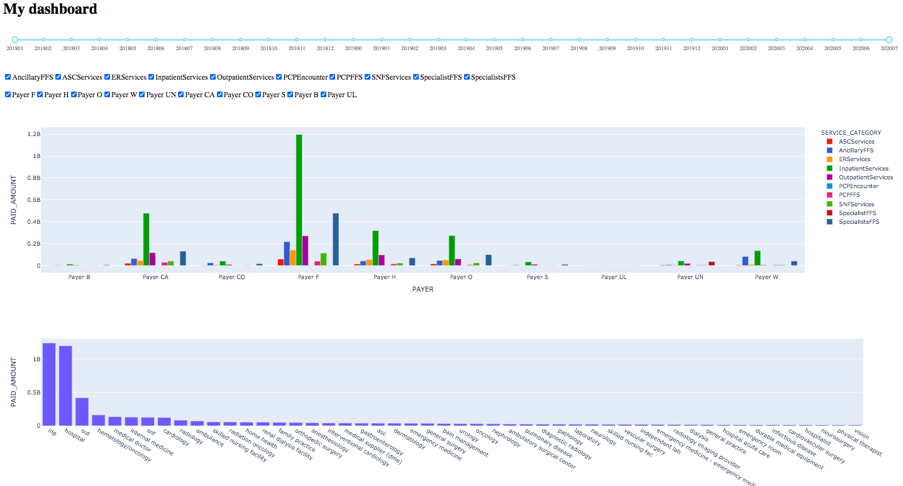

# Dashboard with a date range and slicers and dicers

## Install and run
```
cd dash_dashboard
conda create -n dash python=3.8
pip install -r requirements.txt
python main.py
```

## View online
[AWS online server!](http://ec2-18-220-65-4.us-east-2.compute.amazonaws.com:8050/)


